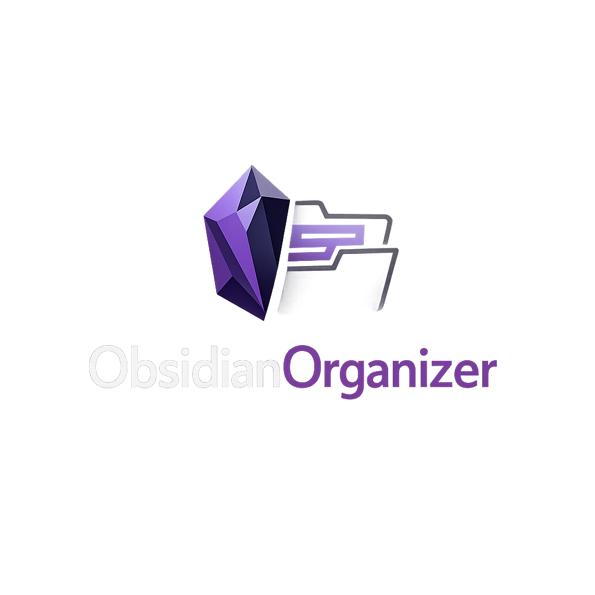
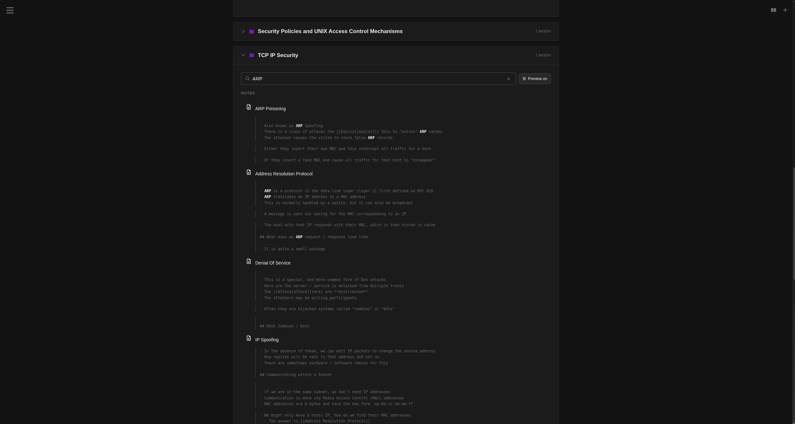
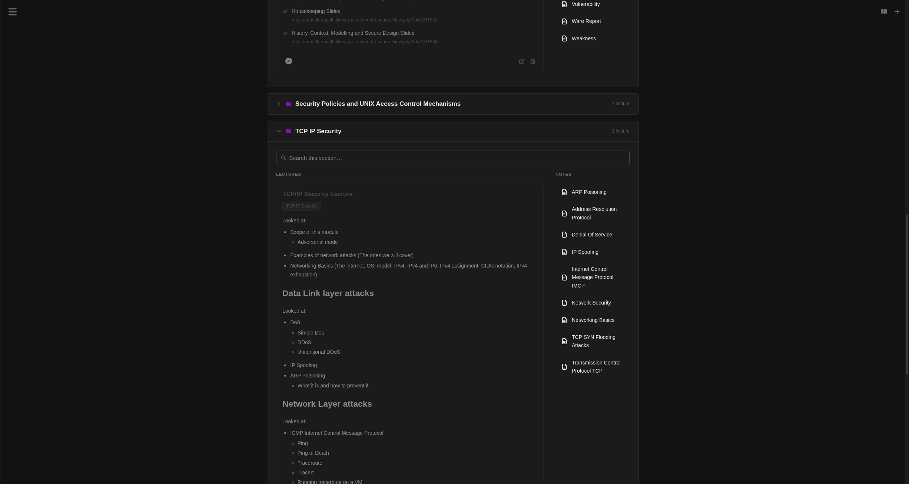
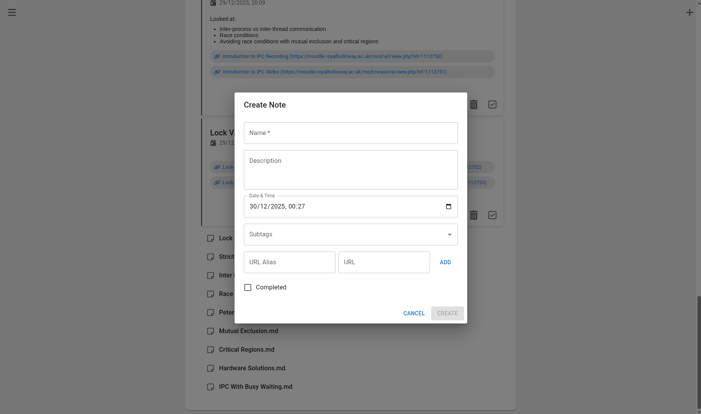

<p align="center">
  
</p>

A note-taking app for organizing an Obsidian vault with a consistent module/topic structure.

- One web page per module
- One section per topic
- Note descriptions stay compact until content actually overflows
- Rename module categories directly from the module page
- Reorder module categories and lecture notes with persisted drag-and-drop sorting
- Built-in 25/5 Pomodoro timer in the top bar with a repeating completion alarm and system notification on focus completion
- Notes grouped by tags and still fully Obsidian-compatible (wikilinks, markdown, etc.)
- Built-in RAG chat over your vault notes
- Organisation tool to quickly and easily tag repositories

## Screenshots

**1. Modules Page**



**2. Organisation tool**



**3. RAG chat**



## Prerequisites

Core tooling:

- `node` + `npm`
- `python 3.12+`
- `poetry`
- `make`
- `mprocs`

RAG tooling:

- `ollama` (running locally)

## Ollama Setup (Required for RAG)

The backend is configured to use Ollama by default (`backend/backend/backend/settings.py`).

Default models:

- Generation model: `llama3.2`
- Embedding model: `nomic-embed-text`

Install and start Ollama, then pull models:

```sh
ollama serve
```

In another terminal:

```sh
ollama pull llama3.2
ollama pull nomic-embed-text
```

Optional check:

```sh
ollama list
```

You should see both models available before using RAG indexing/query.

## Configuration

The default vault path is currently set in `backend/backend/backend/settings.py`:

- `VAULT_PATH = "/home/aleks/SecondBrain/"`

If your Obsidian vault is elsewhere, update `VAULT_PATH` accordingly.

Relevant RAG config (same file):

- `PROVIDER = "ollama"`
- `OLLAMA_BASE_URL = "http://localhost:11434"`
- `GENERATION_MODEL = "llama3.2"`
- `EMBEDDING_MODEL = "nomic-embed-text"`

## Setup and Run

1. Clone the repository:

```sh
git clone git@github.com:Aleks-Tacconi/ObsidianOrganizer.git
```

2. Enter project directory:

```sh
cd ObsidianOrganizer
```

3. Install dependencies (frontend + backend):

```sh
make install
```

4. Run frontend and backend together:

```sh
make run
```

Frontend runs via Vite, backend runs via Django.

## Useful Commands

Frontend:

```sh
cd frontend && make lint
cd frontend && npm run build
```

Backend:

```sh
cd backend && make lint
cd backend && poetry run python backend/manage.py test
```

## RAG Quick Start

1. Ensure Ollama is running and both models are pulled.
2. Ensure `VAULT_PATH` points to a real vault with `.md` files.
3. Open the RAG page and click **Update Vector Index**.
4. Wait for indexing to complete, then ask questions.
5. Use `@filename.md` in the query box to force context from specific notes.

## Troubleshooting

- **Indexing stuck at `running · 0/0 files · 0 chunks`**:
  - Check `VAULT_PATH` exists and contains markdown files.
  - Check Ollama is running on `http://localhost:11434`.
  - Check required models are pulled.
- **Ollama unavailable in UI**:
  - Start `ollama serve`.
  - Verify with `ollama list`.

## TODO / Upcoming Features

- Expand module-level organisation controls further
